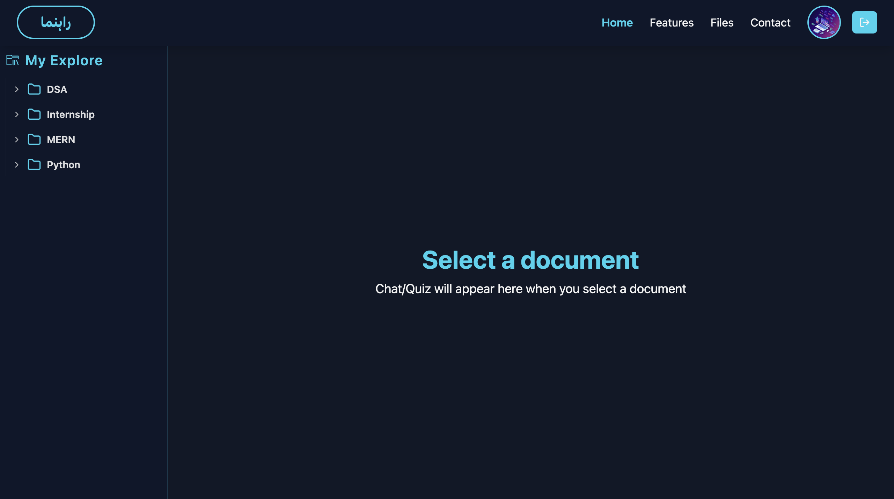
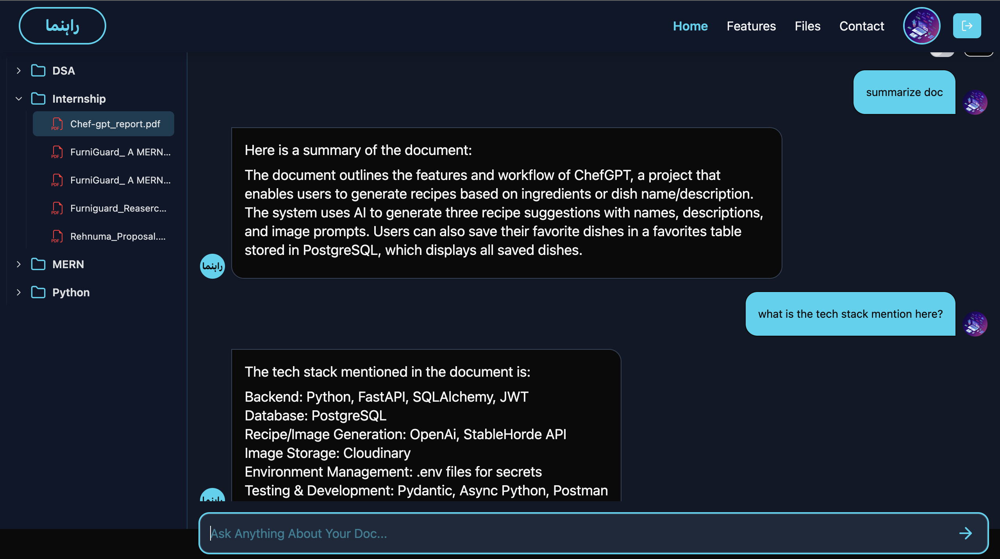
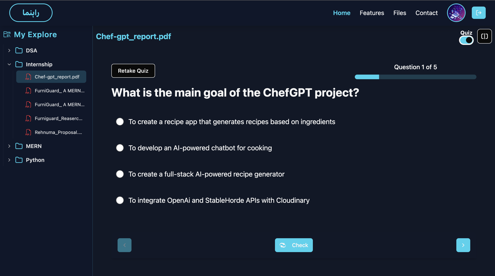
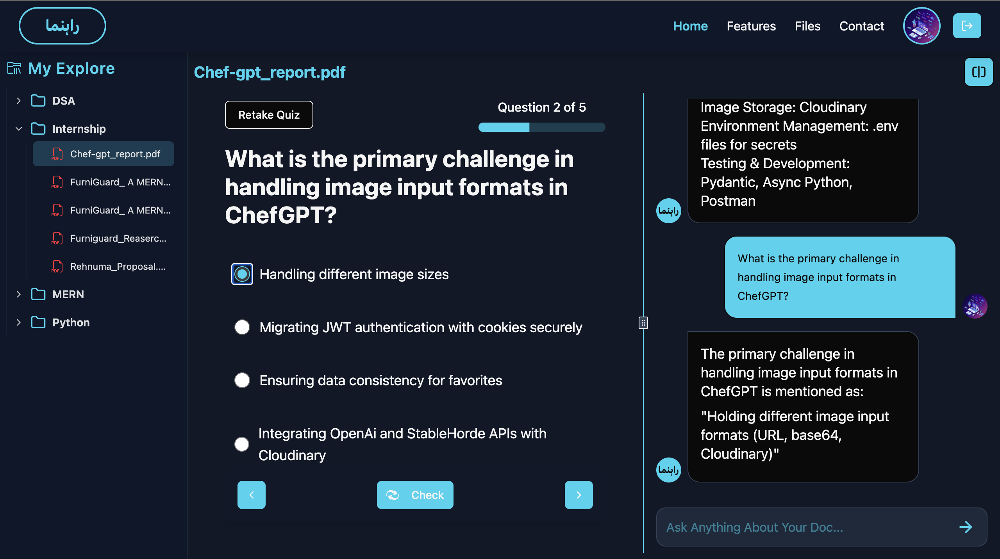
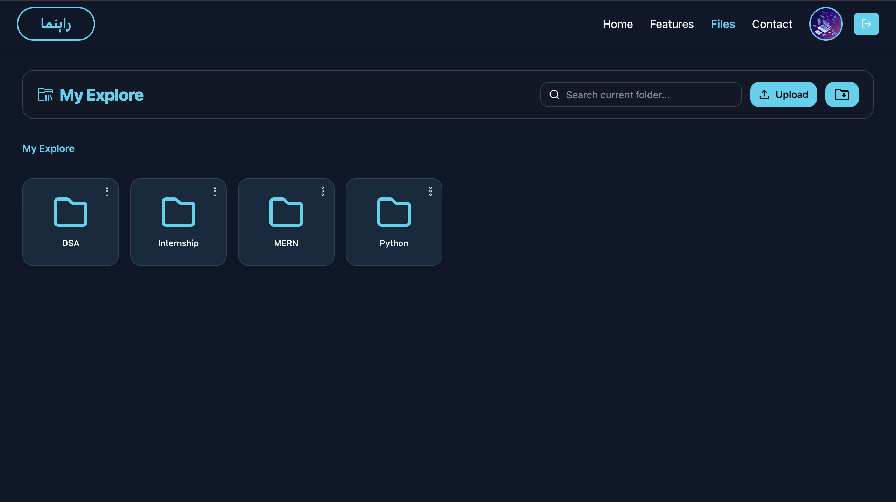

# Rahnuma - Your Personal AI Study Partner

Rehnuma is an AI-powered learning platform that transforms your notes into an interactive, personalized study experience. Instead of re-reading PDFs or wasting time searching through pages, Rehnuma lets you chat with your notes, ask questions, and even get AI-generated quizzes — turning passive reading into active, intelligent learning.

## Key Features
- Two smart Modes:
    - Exploration Mode: Ask questions in plain English and get answers directly from your uploaded notes.
    - Challenge Mode: Get AI-generated quizzes and feedback to reinforce active recall.
- AI-Powered RAG Pipeline: (Retrieval-Augmented Generation)
    - Searches your documents and generates accurate answers — privately and locally.
- Document Intelligence:
    - Upload PDFs,Docx,PPTs,TXTs,Images and the system instantly indexes and understands the content.
- Privacy First:
    - All processing done on open-source models — no data sent to third-party APIs.

## Tech Stack

**Frontend :** React, Tailwind CSS, TypeScript, Shadcn UI


**Backend:** FastAPI,Python, Pydentic


**Database:** PostgreSQL + SQLAlchemy, Alembic


**Authentication:** JWT, Google Oauth


**Vector Database:** ChromaDB


**AI & ML Engine:** Ollama (Llama 3 8B),Langchain,Sentence-Transformers


**Worker Queue & Caching:** Celery + Redis with docker


# Getting Started

## Prequisities
Before you begin make sure the following installed:
- Python 3.12.5 or latest
- Ollama + llama3:8b locally installed
- PostgreSQL running locally or cloud instance
- Celery running via docker

## Installation

```bash
# Clone the repo

git clone https://github.com/faizan9262/rahnuma.git
cd rahnuma
```

## Backend Setup
```bash
# Start the fastapi server
cd server
pip install -r requirements.txt
uvicorn app.main:app --reload
```

## Frontend Setup
```bash
# Run frontend on localhost
cd client
npm install
npm run dev
```

## Worker Setup
```bash
# make sure docker is active
cd server
celery -A app.worker.celery_app worker --loglevel=info
```

## Environment Variables
Create `.env` file in `/server` folder and add these variables in that:

```bash
DATABASE_URL=your_database_url

JWT_SECRET=your_jwt_secret

SECRET_KEY=your_secret

GOOGLE_CLIENT_ID=your_google_client_id
GOOGLE_CLIENT_SECRET=your_google_client_secret
GOOGLE_REDIRECT_URI=your_callback_url

CLOUDINARY_SECRET_KEY =your_claoudinary_secret_key
CLOUDINARY_API_KEY =your_cloudinary_api_key
CLOUDINARY_NAME =your_cloudinary_name

GOOGLE_APPLICATION_CREDENTIALS=path_to_your_google_application_credentials.json
```

## Core Enpoints

### Authentication

| Method | Endpoint | Description |
|--------|-----------|-------------|
| `POST` | `/auth/register` | Register new user|
| `POST` | `/auth/login` | Login |
| `POST` | `/auth/logout` | Logout |
| `GET` | `/auth/me` | User authentication |
| `GET` | `/auth/google/login` | Google oAuth Login |
| `GET` | `/auth/calback` | oAuth Callback Url |

### Documents 

| Method | Endpoint | Description |
|--------|-----------|-------------|
| `POST` | `/documents/upload` | Upload file to database and set in queue for sliping and vectorization|
| `GET` | `/documents/list` | List of all document of user |
| `DELETE` | `/documents/delete/:doc_id` | Delete document with provided id |
| `GET` | `/document/download/:doc_id` | Download document with provided id |

### Search & Quiz

| Method | Endpoint | Description |
|--------|-----------|-------------|
| `POST` | `/search/:doc_id` | Query search in document with provided id|
| `POST` | `/search/quiz-chunk/:doc_id` | Generate Quiz from document with provided id |
| `POST` | `/search/check/:doc_id` | Check the answer for each question |

### Folder

| Method | Endpoint | Description |
|--------|-----------|-------------|
| `POST` | `/folder/create` | Create folder|
| `POST` | `/folder/add-doc` | Add document in folder (Cut/Copy & Paste) |
| `GET` | `/folder/get` | Fetch documents and sub-folder in the current folder|
| `POST` | `/folder/folder-docs` | Fetch only document of current folder|

## 📸 Screenshots

### 🏠 Home Page


### 🎆 Exploration Mode (Chat with doc)


### 💬 Challenge Mode (Quiz)


### 💬 Split Mode


### 📅 Documents Page


## Demo Video

🎥 [Watch Demo on Loom](https://www.loom.com/share/demo-link)


## 👨‍💻 Author

**Faizan Shaikh**  
**Full-Stack Developer**  

📧 [faizanshaikh9262@gmail.com](mailto:faizan.dev@gmail.com)  
🔗 [LinkedIn](https://www.linkedin.com/in/faizan9262) | [GitHub](https://github.com/faizan9262)